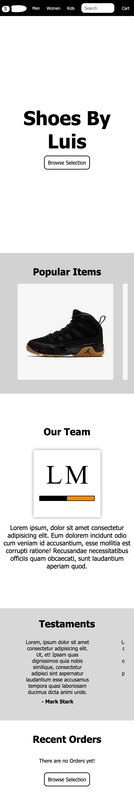
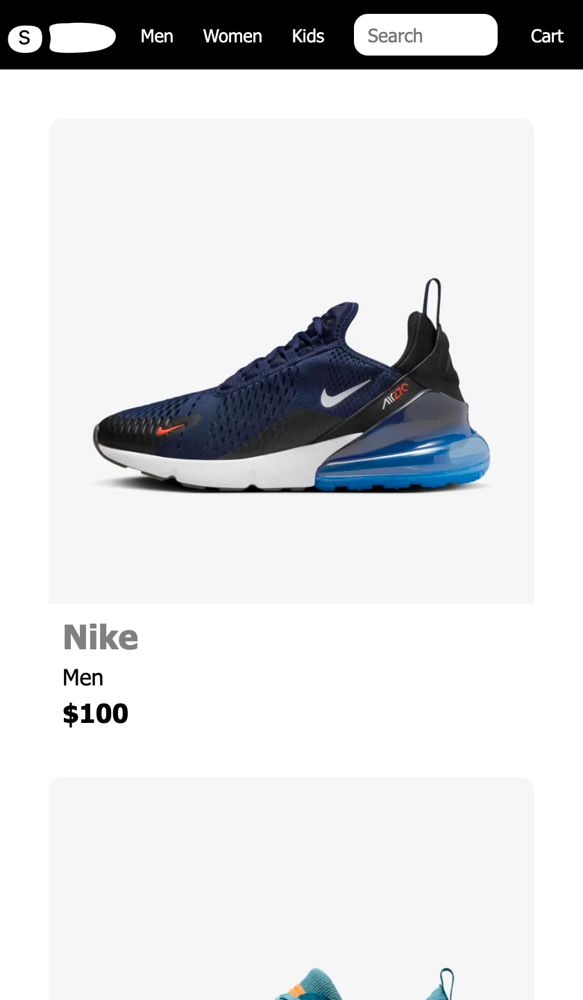
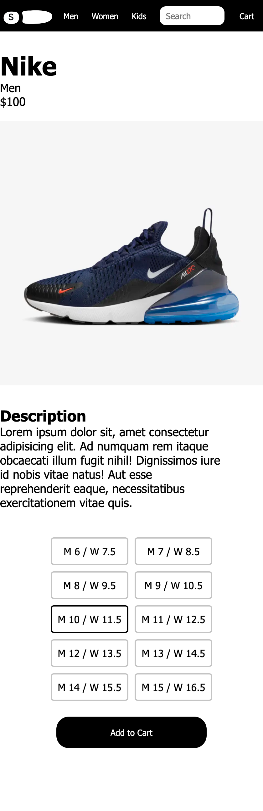
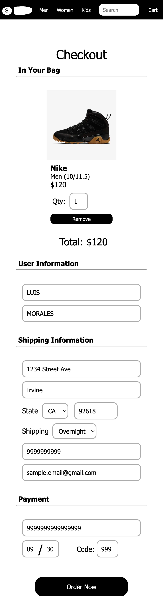
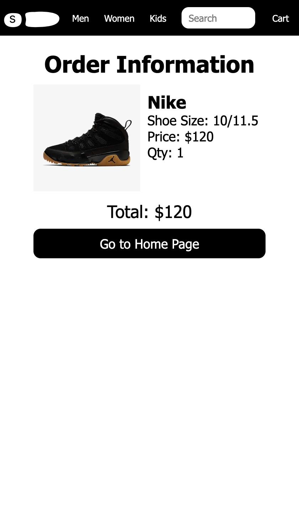

# Overview
 The client server takes care of the routing of the client pages. It also handles the session, and the cart that is to be kept on the session. The server server takes care of the API routing. It handles three resources, items, orders, order items, and zipcodes. Each has their respective types of calls and responses, look at Server (API) section for more info.  

## Instructions  
External Dependencies:  

- MySQL (version: latest)  

Internal Dependencies (run npm install):  

- sequelize
- express
- cors
- express-session
- etc...

### Duplication of Development:

First install all dependencies, external through own means and internal through npm. 

Note: `npm install` must be called under two directories, the server directory and client directory.

Under 'server > app > config' edit the 'db.config.js' file. Edit lines 6-8, in other words, edit the variables 'USER', 'PASSWORD', and 'DB' to a newly created mysql database with your own username (USER), password (PASSWORD), and database name (DB). To reproduce exactly what I did, I created a new database named 'inf124' in mysql using the mysql workbench, then I edited the 'PASSWORD' variable to have my own password. 

Run the server for API, under 'server' run `node server`. This will initialize and create the tables for the database using sequelize. After about 20 seconds feel free to close/exit the program (ctrl + c). 

Under 'server > data' there will be two files 'items.csv' and 'zip_codes.csv' which should be imported into your mysql database. Choose your own method for importing into the **Items** and **ZipCodes** tables, respectively, inside the database. 

If no errors encountered on your part, then you will have successfully imported the required data and will no be able to run both the API server and WebApp server. 

### Walkthough
1. Run server with `npm run server` under the 'server' directory
2. Run client with `npm run server` under the 'client' directory
3. Open locally at [Local Website Link](http://localhost:8080)

## Client (WebApp)
### Running
Run `npm install` to install dependencies using npm.  
Run `npm run server` to run server.

Open locally at [Local Website Link](http://localhost:8080)

### General Layout  
Page Tree  
- [Home Page](http://localhost:8080)  
  - [Product Page](http://localhost:8080/browse)  
    - [Product Details Page(Sample)](http://localhost:8080/details/1)   
  - [Men Page](http://localhost:8080/browse/men)  
  - [Women Page](http://localhost:8080/browse/women)  
  - [Kid Page](http://localhost:8080/browse/kid)  
  - [Checkout](http://localhost:8080/checkout)  
    - [Order Details Page(Sample)](http://localhost:8080/order/40)  

  
  
Sample View

  

Home Page

  

Product Page - Men/Women/Kid are derived

  

Product Details Page

  

Checkout Page

  

Order Details Page

  

  

  

### Documentation  
Internal server calls (API-like) for session cart.  

Format:  

- Method Type  
- Request URL  
- Sample Request  
- Sample Response  

1. Send an Order  
   * 'POST'  
   * http://localhost:5500/cart/order  
   * http://localhost:5500/cart/order  
      body: {
        "firstName":"LUIS",  
        "lastName":"MORALES",  
        "phone":"9999999999",  
        "email":"SAMPLE@GMAIL.COM",  
        "address":"1234 STREET AVE",  
        "city":"IRVINE",  
        "shippingMethod":"1-DAY"  
      }   
   *  {redirect to 'order'}  
  
2. Add item to Cart  
   * 'POST'  
   * http://localhost:5500/cart  
   * http://localhost:5500/cart  
      body: {
         "sku":"11",
         "shoeSize":"15/16.5"
      }
   *  {redirect to 'checkout'}  

3.  
   * 'GET'  
   * http://localhost:5500/cart   
   * http://localhost:5500/cart   
   * [{"sku":"11","shoeSize":"15/16.5","quantity":1}]   
  
4.  
   * 'PUT'  
   * http://localhost:5500/cart  
   * http://localhost:5500/cart  
      body: {
         "sku":"11",
         "shoeSize":"15/16.5"
         "quantity":2
      }
   * {"before":1,"after":2}

5.  
   * 'DELETE'  
   * http://localhost:5500/cart  
   * http://localhost:5500/cart  
   * {"message":"Cart was updated successfully."}    
  

## Server (API)
### Running
Run `npm install` to install dependencies using npm.  
Run `npm run server` to run server.

Open locally at [API Link](http://localhost:5500/api)

### General Layout  

Main Directory - http://localhost:5500/api  

#### Images resource  
http://localhost:5500/api/images  
#### Zip Code resource  
http://localhost:5500/api/zipcode  
#### Orders resource  
http://localhost:5500/api/orders  
#### Item Order resource  
http://localhost:5500/api/item-order  
#### Items resource  
http://localhost:5500/api/items  

### Documentation  
#### FORMAT for API calls  
   * Method Type  
   * Request URL
   * Sample Request  
   * Sample Response  

#### Image resource  
   * 'GET'  
   * http://localhost:5500/api/images/:image  
   * http://localhost:5500/api/images/shoe_kid_white_1.png  
   * { img type }  

#### Zip Code resource
1.  
   * 'GET'  
   * http://localhost:5500/api/zipcode  
   * http://localhost:5500/api/zipcode?state=CA&city=Irvine  
   * [{"zip":92714,"state":"CA","city":"Irvine"},  
      {"zip":92715,"state":"CA","city":"Irvine"},  
      {"zip":92718,"state":"CA","city":"Irvine"},  
      {"zip":92720,"state":"CA","city":"Irvine"}]    
  
2.  
   * 'GET'  
   * http://localhost:5500/api/zipcode/:zipcode  
   * http://localhost:5500/api/zipcode/92714  
   * {"zip":92714,"state":"CA","city":"Irvine"}  

#### Item resource
1.  
   * 'GET'  
   * http://localhost:5500/api/items  
   * http://localhost:5500/api/items?color=purple  
   * [{"sku":17,"brand":"nike","type":"women","color":"purple","price":120,"image":"shoe_women_purple_1.png"},
      {"sku":18,"brand":"nike","type":"women","color":"purple","price":120,"image":"shoe_women_purple_2.png"}]    
  
2.  
   * 'GET'  
   * http://localhost:5500/api/items/:sku  
   * http://localhost:5500/api/items/1  
   * {"sku":1,"brand":"nike","type":"men","color":"blue","price":100,"image":"shoe_men_blue_1.png"}  

#### Order resource
1.  
   * 'POST'  
   * http://localhost:5500/api/orders  
   * http://localhost:5500/api/orders  
      body: {
         "firstName":"LUIS",  
         "lastName":"MORALES",  
         "phone":"9999999999",  
         "email":"SAMPLE@GMAIL.COM",  
         "address":"1234 STREET AVE",  
         "city":"IRVINE",  
         "shippingMethod":"1-DAY",  
         "ratingId":null,  
         "userId":"pUpVG2v3HcJ2fp3g7nfXoWWdAN1RUH18"  
      }
   * {
      "id":10, 
      "firstName":"LUIS",  
      "lastName":"MORALES",  
      "phone":"9999999999",  
      "email":"SAMPLE@GMAIL.COM",  
      "address":"1234 STREET AVE",  
      "city":"IRVINE",  
      "shippingMethod":"1-DAY",  
      "ratingId":null,  
      "userId":"pUpVG2v3HcJ2fp3g7nfXoWWdAN1RUH18"  
      }  

2.  
   * 'GET'  
   * http://localhost:5500/api/orders/:id  
   * http://localhost:5500/api/orders/10  
   * {
        "id":10, 
        "firstName":"LUIS",  
        "lastName":"MORALES",  
        "phone":"9999999999",  
        "email":"SAMPLE@GMAIL.COM",  
        "address":"1234 STREET AVE",  
        "city":"IRVINE",  
        "shippingMethod":"1-DAY",  
        "ratingId":null,  
        "userId":"pUpVG2v3HcJ2fp3g7nfXoWWdAN1RUH18"  
      }  
3.  
   * 'GET'  
   * http://localhost:5500/api/orders/user/:id  
   * http://localhost:5500/api/orders/user/pUpVG2v3HcJ2fp3g7nfXoWWdAN1RUH18  
   * [{
        "id":10, 
        "firstName":"LUIS",  
        "lastName":"MORALES",  
        "phone":"9999999999",  
        "email":"SAMPLE@GMAIL.COM",  
        "address":"1234 STREET AVE",  
        "city":"IRVINE",  
        "shippingMethod":"1-DAY",  
        "ratingId":null,  
        "userId":"pUpVG2v3HcJ2fp3g7nfXoWWdAN1RUH18"  
      }]  
4.  
   * 'PUT'  
   * http://localhost:5500/api/orders/:id  
   * http://localhost:5500/api/orders/10  
   * {"message":"Order was updated successfully"}  
5.  
   * 'DELETE'  
   * http://localhost:5500/api/orders/:id  
   * http://localhost:5500/api/orders/10  
   * {"message":"Order was deleted successfully"}  

#### Item Order resource  
1.  
   * 'GET'  
   * http://localhost:5500/api/item-order  
   * http://localhost:5500/api/item-order?quantity=10  
   * [{"id":36,"orderId":43,"sku":2,"quantity":10,"shoeSize":"10/11.5"}]    
  
2.  
   * 'GET'  
   * http://localhost:5500/api/item-order/:orderid  
   * http://localhost:5500/api/item-order/25  
   * [{"id":14,"orderId":25,"sku":21,"quantity":1,"shoeSize":"10/11.5"}]  
